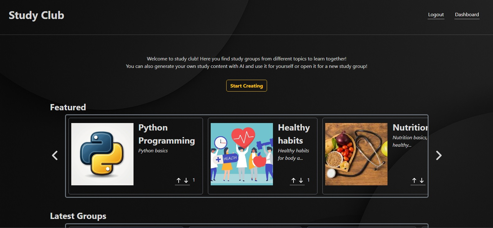
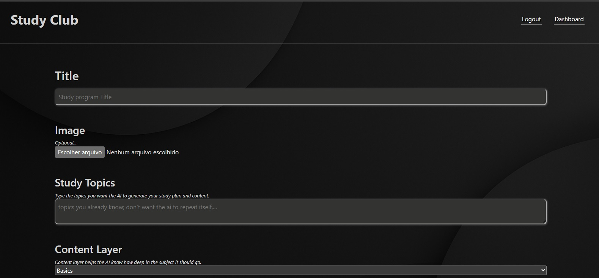
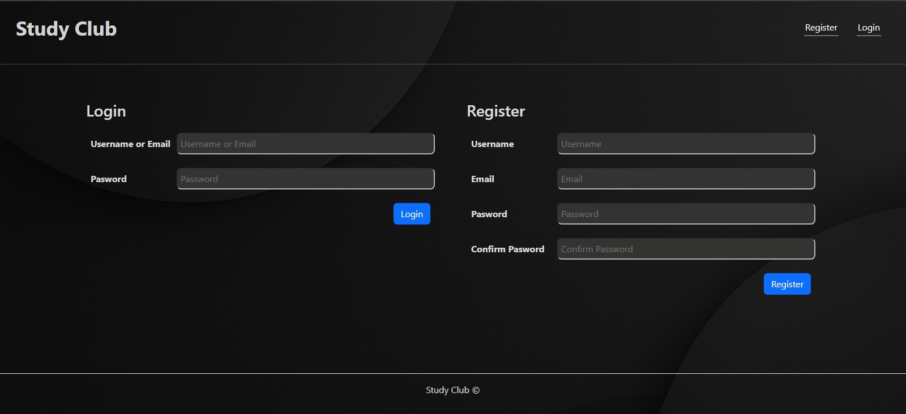
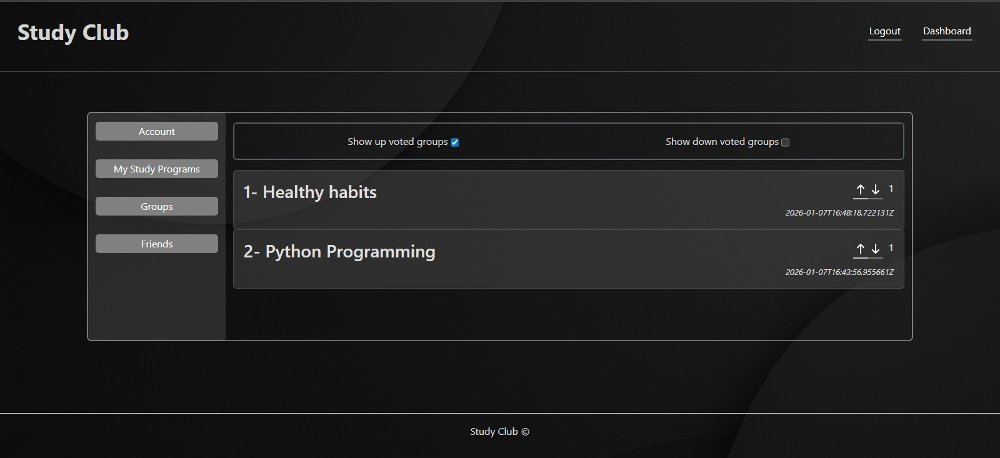
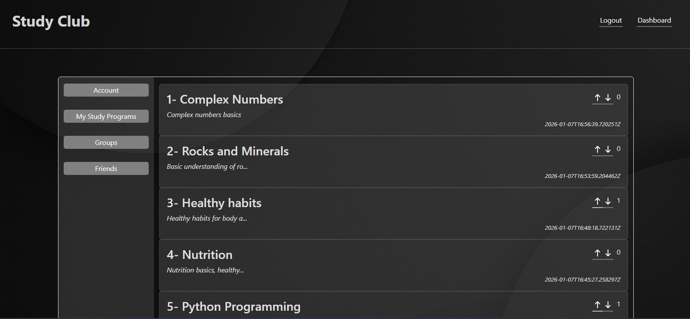
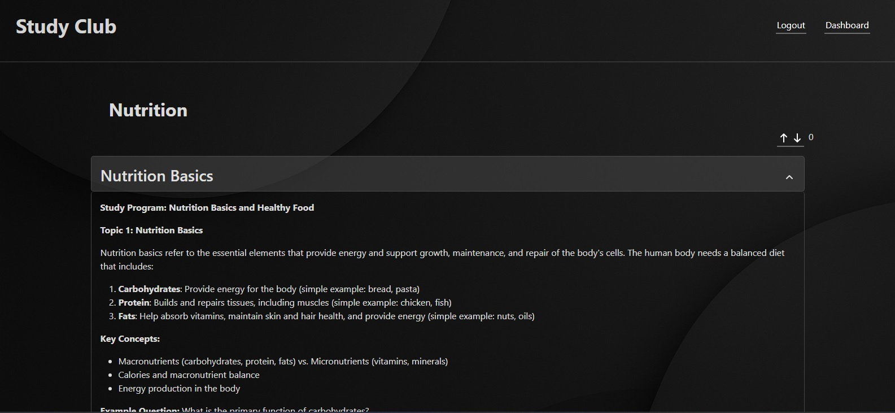

Study Club
--

Website that uses AI to generate study topics and their respective content based on the user preferences.

Public study plans can be displayed to others so users can share their study content.

Backend
--

- Django Rest Framework
- SQLite Database
- Langchain/Langgraph
- AI Agents
- OAuth2 authentication

**Packages**

1. [accounts](https://github.com/c-azb/StudyClub/tree/main/backend_app/djangorestapi/accounts): Handles authentication.
2. [api](https://github.com/c-azb/StudyClub/tree/main/backend_app/djangorestapi/api): Handles API versions.
3. [djangorestapi](https://github.com/c-azb/StudyClub/tree/main/backend_app/djangorestapi/djangorestapi): Main Django app.
4. [StudyGeneration](https://github.com/c-azb/StudyClub/tree/main/backend_app/djangorestapi/StudyGeneration): Handles the study program's data by generating new study programs and retrieving and deleting.
5. [src](https://github.com/c-azb/StudyClub/tree/main/backend_app/djangorestapi/StudyGeneration/src): Implements the AI system responsible for generating the study plan and content. It also creates custom prompts based on the user preferences.
5. [StudyGroup](https://github.com/c-azb/StudyClub/tree/main/backend_app/djangorestapi/StudyGroup): Implements up/down vote system

Frontend
--

- React.js Framework application

**Start screen**

- Display featured content and latest public study groups.

**Generate screen**

- The user enters his ideas and study style so the AI can generate his desired study program.

**Login or register screen**

**Voted groups screen**

- The user can find his upvoted study programs.

**My group's screen**

- The user can find his generated study programs.

**Study viewer**

- The user views a study program. If he owns the program, he can delete or regenerate it also.

